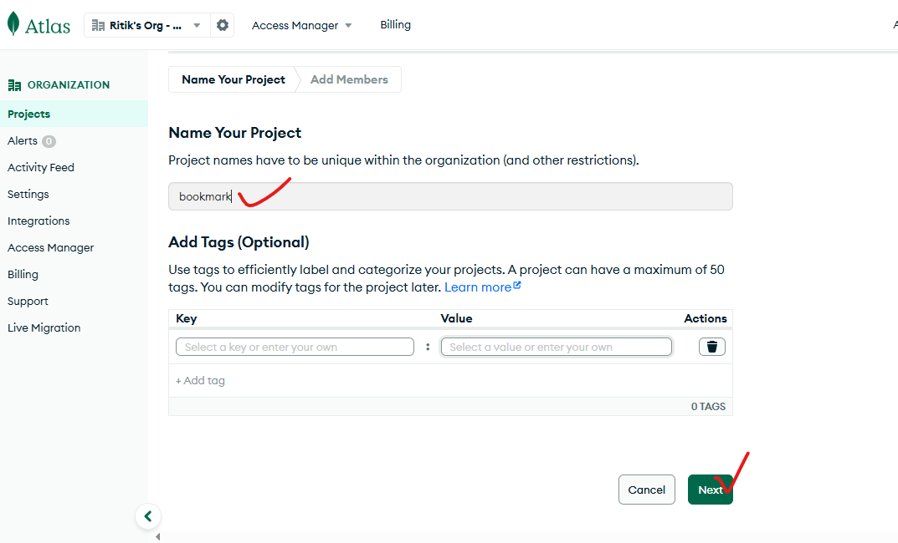
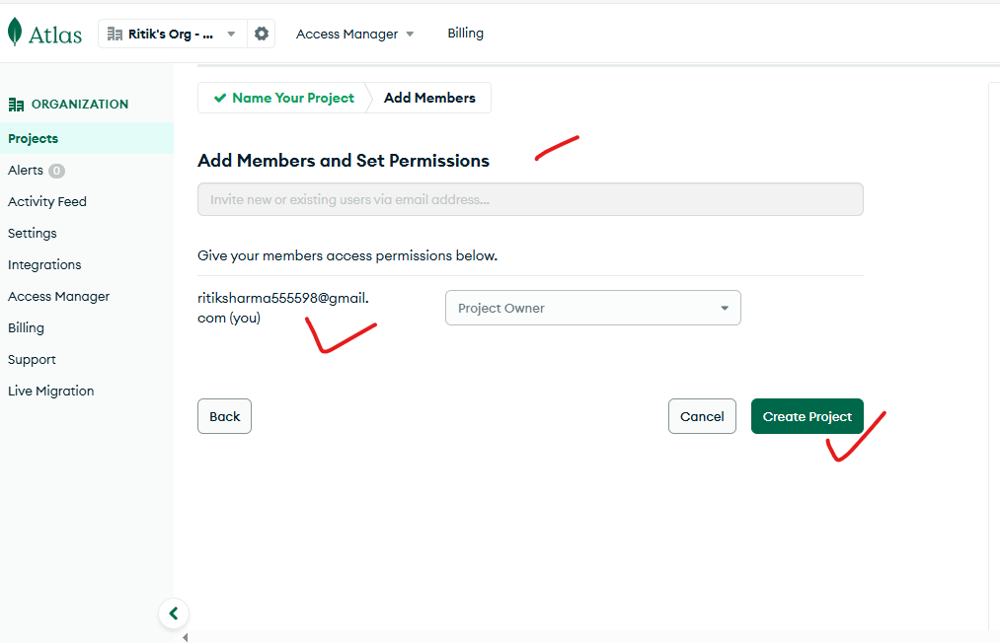
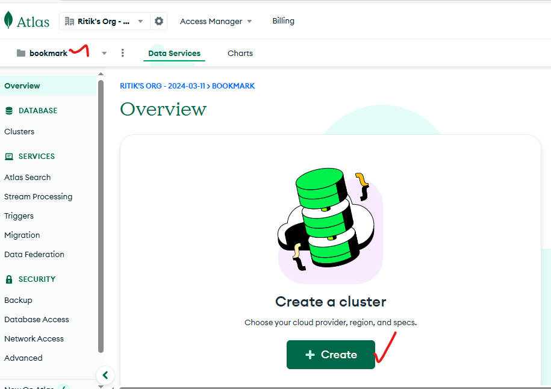
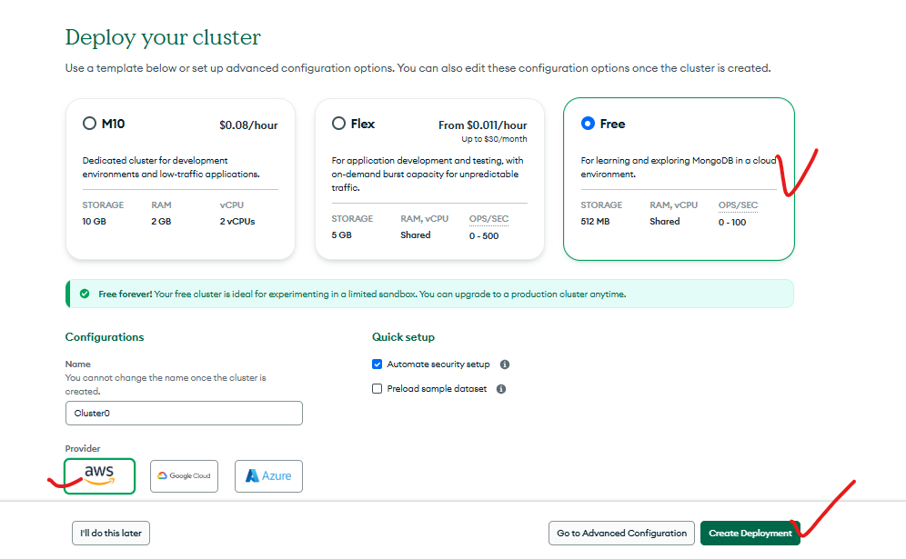
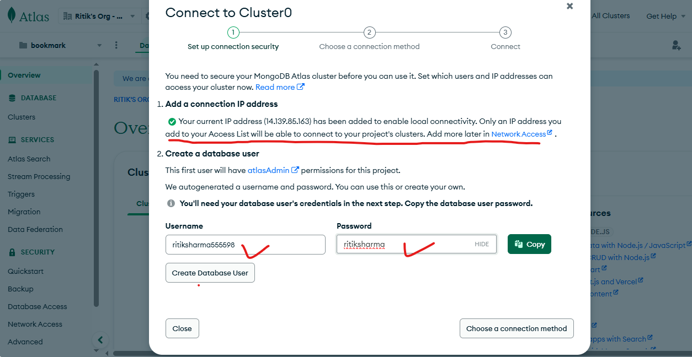
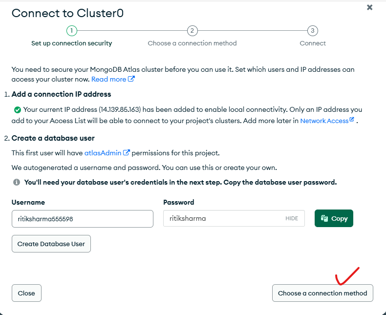
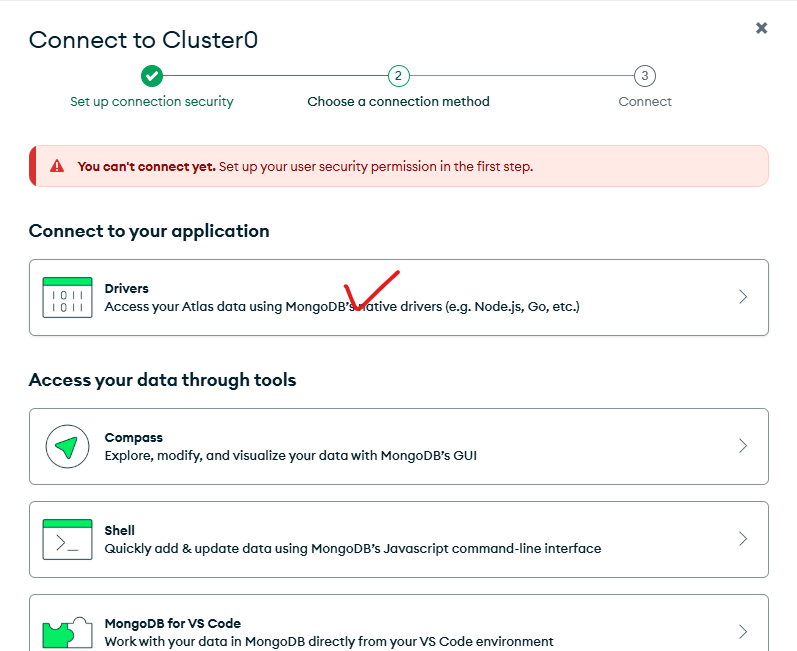
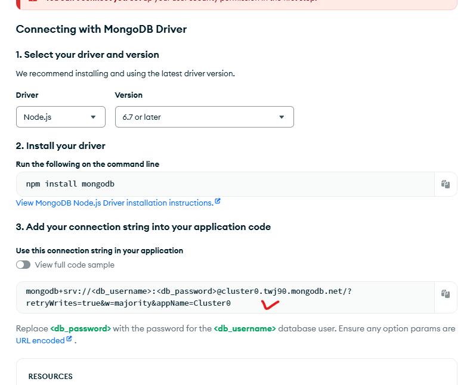

Here’s a step-by-step guide to create your bookmark application:

---

## **1. Plan the Application**
### **Key Features:**
1. **Homepage**: Introduction and overview of the application.
2. **Authentication**:
   - User **Registration** and **Login**.
   - Authenticated users access their **dashboard**.
3. **Dashboard**:
   - Add, Edit, Delete bookmarks.
   - **Fixed fields**: Name, Purpose, Description, Category, and Date.
   - **Dynamic fields**: Users can add optional columns (e.g., Link, Additional Description) dynamically using a button.
4. **Backend API**: Handle CRUD operations and user authentication.
5. **Frontend**:
   - User interface for all operations.
   - Form with dynamic input fields for bookmarks.

---

## **2. Set Up the Project**
### **Backend Setup** (Node.js + Express + MongoDB)
#### **1. Initialize the Backend:**
```bash
mkdir bookmark-app
cd bookmark-app
npm init -y
npm install express mongoose bcryptjs jsonwebtoken body-parser cors dotenv
```

#### **2. Folder Structure:**
```
backend/
├── models/
│   ├── User.js
│   ├── Bookmark.js
├── routes/
│   ├── authRoutes.js
│   ├── bookmarkRoutes.js
├── middleware/
│   └── authMiddleware.js
├── db/
│   └── db.js
├── server.js
└── .env
```

---

### **Step-by-Step Implementation**

### **Step 1: Database Setup**
#### **1. Connect to MongoDB (`db/db.js`)**:
```javascript
const mongoose = require('mongoose');

const connectDB = async () => {
    try {
        await mongoose.connect(process.env.MONGO_URI, {
            useNewUrlParser: true,
            useUnifiedTopology: true,
        });
        console.log('MongoDB connected!');
    } catch (error) {
        console.error(error.message);
        process.exit(1);
    }
};

module.exports = connectDB;
```

#### **2. User Model (`models/User.js`)**:
```javascript
const mongoose = require('mongoose');

const UserSchema = new mongoose.Schema({
    username: {
        type: String,
        required: true,
        unique: true,
    },
    email: {
        type: String,
        required: true,
        unique: true,
    },
    password: {
        type: String,
        required: true,
    },
});

module.exports = mongoose.model('User', UserSchema);
```

#### **3. Bookmark Model (`models/Bookmark.js`)**:
```javascript
const mongoose = require('mongoose');

const BookmarkSchema = new mongoose.Schema({
    name: { type: String, required: true },
    purpose: { type: String, required: true },
    description: { type: String, required: true },
    category: { type: String, required: true },
    date: { type: Date, default: Date.now },
    user: { type: mongoose.Schema.Types.ObjectId, ref: 'User' },
    dynamicFields: { type: Array, default: [] }, // Store additional fields dynamically
});

module.exports = mongoose.model('Bookmark', BookmarkSchema);
```

---

### **Step 2: Authentication**
#### **1. Register and Login Routes (`routes/authRoutes.js`)**:
```javascript
const express = require('express');
const bcrypt = require('bcryptjs');
const jwt = require('jsonwebtoken');
const User = require('../models/User');
const router = express.Router();

router.post('/register', async (req, res) => {
    const { username, email, password } = req.body;
    try {
        const hashedPassword = await bcrypt.hash(password, 10);
        const user = new User({ username, email, password: hashedPassword });
        await user.save();
        res.status(201).json({ message: 'User registered successfully!' });
    } catch (error) {
        res.status(500).json({ error: 'Registration failed!' });
    }
});

router.post('/login', async (req, res) => {
    const { email, password } = req.body;
    try {
        const user = await User.findOne({ email });
        if (!user) return res.status(404).json({ error: 'User not found!' });

        const isMatch = await bcrypt.compare(password, user.password);
        if (!isMatch) return res.status(400).json({ error: 'Invalid credentials!' });

        const token = jwt.sign({ id: user._id }, process.env.JWT_SECRET, { expiresIn: '1h' });
        res.status(200).json({ token, user: { id: user._id, username: user.username } });
    } catch (error) {
        res.status(500).json({ error: 'Login failed!' });
    }
});

module.exports = router;
```

#### **2. Authentication Middleware (`middleware/authMiddleware.js`)**:
```javascript
const jwt = require('jsonwebtoken');

const authMiddleware = (req, res, next) => {
    const token = req.header('Authorization');
    if (!token) return res.status(401).json({ error: 'Access Denied!' });

    try {
        const verified = jwt.verify(token, process.env.JWT_SECRET);
        req.user = verified.id;
        next();
    } catch (error) {
        res.status(400).json({ error: 'Invalid Token!' });
    }
};

module.exports = authMiddleware;
```

---

### **Step 3: Bookmark Management**
#### **1. Bookmark Routes (`routes/bookmarkRoutes.js`)**:
```javascript
const express = require('express');
const Bookmark = require('../models/Bookmark');
const authMiddleware = require('../middleware/authMiddleware');
const router = express.Router();

// Create Bookmark
router.post('/add', authMiddleware, async (req, res) => {
    const { name, purpose, description, category, dynamicFields } = req.body;
    try {
        const bookmark = new Bookmark({ name, purpose, description, category, user: req.user, dynamicFields });
        await bookmark.save();
        res.status(201).json(bookmark);
    } catch (error) {
        res.status(500).json({ error: 'Failed to add bookmark!' });
    }
});

// Fetch User's Bookmarks
router.get('/', authMiddleware, async (req, res) => {
    try {
        const bookmarks = await Bookmark.find({ user: req.user });
        res.status(200).json(bookmarks);
    } catch (error) {
        res.status(500).json({ error: 'Failed to fetch bookmarks!' });
    }
});

module.exports = router;
```

---

### **Step 4: Frontend (React)**
#### **1. Dynamic Bookmark Form**:
- Create a form where users can:
  - Add fixed fields (Name, Purpose, etc.).
  - Add optional dynamic fields by clicking a button.

Example: `DynamicForm.js`
```javascript
import React, { useState } from 'react';

const DynamicForm = ({ onSubmit }) => {
    const [fields, setFields] = useState([{ name: '', value: '' }]);

    const handleAddField = () => setFields([...fields, { name: '', value: '' }]);

    const handleFieldChange = (index, e) => {
        const newFields = [...fields];
        newFields[index][e.target.name] = e.target.value;
        setFields(newFields);
    };

    const handleSubmit = (e) => {
        e.preventDefault();
        onSubmit(fields);
    };

    return (
        <form onSubmit={handleSubmit}>
            <button type="button" onClick={handleAddField}>Add Field</button>
            {fields.map((field, index) => (
                <div key={index}>
                    <input name="name" placeholder="Field Name" onChange={(e) => handleFieldChange(index, e)} />
                    <input name="value" placeholder="Field Value" onChange={(e) => handleFieldChange(index, e)} />
                </div>
            ))}
            <button type="submit">Submit</button>
        </form>
    );
};

export default DynamicForm;
```

---

### **Step 5: Testing and Deployment**
1. Test the app thoroughly (backend APIs, dynamic fields, etc.).
2. Deploy the backend (e.g., **Render** or **Vercel**) and frontend (e.g., **Netlify**).

Let me know if you need help with any specific step!


####  how to create a new project in mongodb      ##################
1) creating a project in mongoDB 
2) 
3) adding the member for this project
4) 
5) now create a cluster 
6) 
7) 
8) 
9) 
10) 
11) 
12) npm install mongodb
13) npm install jsonwebtoken
